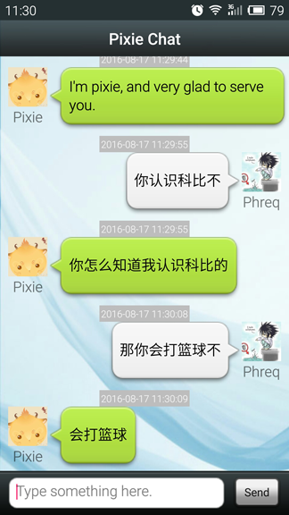
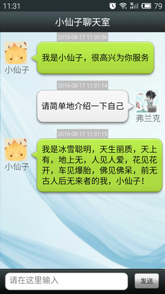

PixieRobot
==========

This is a sample of Turing Robot usage. It provides two kinds of http request mode -- `POST` or `GET` -- to connect the remote server. And then it can automatically be translated to proper language environment according to the system settings, that is `i18n`. You can create a customized robot through the [`Turing Robot website`][1]. If you have to learn the more details, please download it. 
Thanks to [`Hongyang blog`][2] for giving me a lots of help.

## Screenshot
* Language - English (United States)

* Language - Simplified Chinese

[1]: http://www.tuling123.com/
[2]: http://blog.csdn.net/lmj623565791/article/details/38498353

